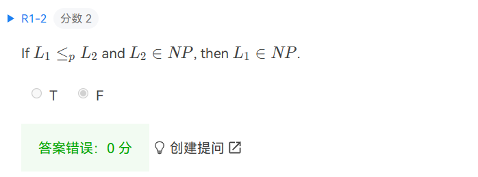
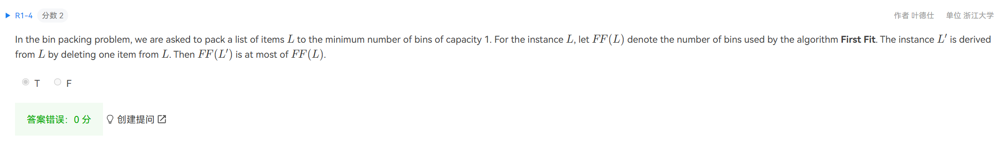
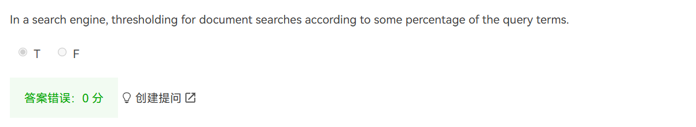
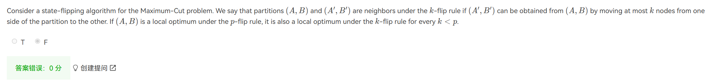
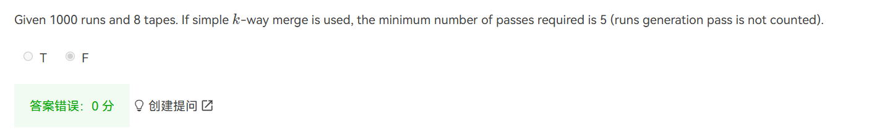
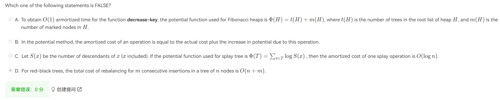
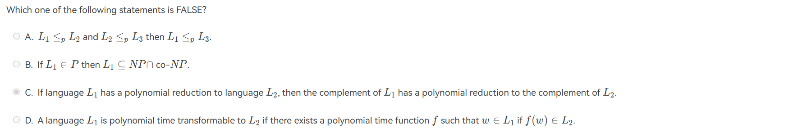
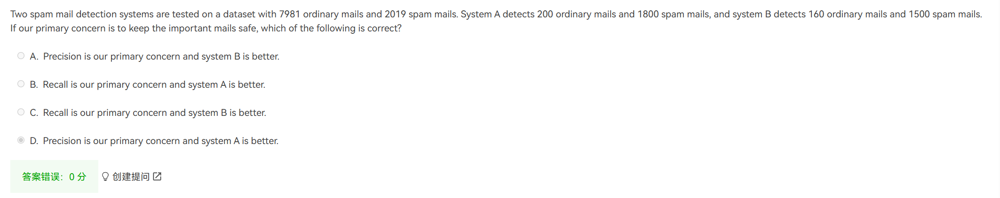
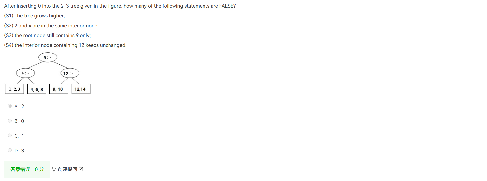

仔细阅读题目描述，不要着急

$78 \rightarrow 85$

复习全面 73就能4.5 80就能4.8

$78 \rightarrow 96$ !!!!

1. 注意是$L_1 \in NP$ 还是 $L_1 = NP$

   

2. ?

   

3. **Tow types of thresholding**

   * Document

     Only retrieve top 10 documents according to their rank.

   * Query term

     Sort query term in ascending by their frequency. Only search for some of them.

   

4. ?

   

5. 

   

6. Potential function for Fibonacci heap is $T(H) + 2m(H)$

   RB-Tree?

   

7. Polynomial-time reducible if exist a polynomial time function $f$ such that $w \in L_1 \mathbf{\huge iff} f(w) \in L_2$ 

   

8. Detects means the emails decided spam-mail by the algorithm

   A: 1800/2000 = 90%

   B: 1500/1660 = 90.3%

   B is better

   

9. interior node leaf node, 仔细读题！！！

   

   

   

