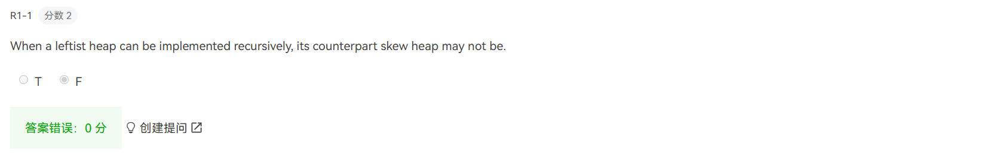
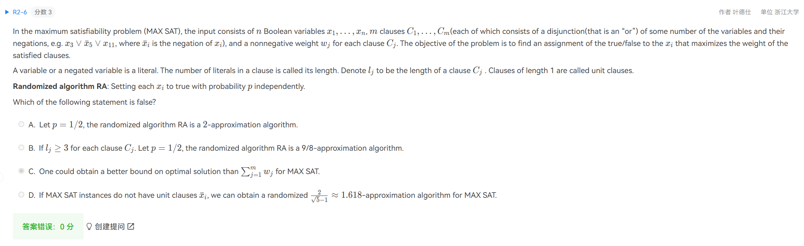

仔细读题，在纸上多画一画，验算一下

如果有不确定的选项，和一个课上讲过的确定的，一定选最确定的

$73 \rightarrow 94$

1. ?

   

2. not FPTAS: $O(n^{2/\epsilon})$ ?

   

3. Random sampling has $W(n) = O(n)$

   

4. compute with more careful. $T(n) = O(n)$

   

5. knapsack problem: approximation >= 2 if P != NP. Summarize NP problems!

   

6. ?

   

7. $O(NlogN)$ inserts, each insert cost $O(logn) = O(log^2n)$

   So each merge costs $O(log^2n)$

   

8. $P(n) = \frac{n}{logn}$

   

9. 1 is not optimal, 2 is optimal

   看作给一个序列，分成最少的上升子序列

   能前后不冲突放置的两个活动，形成偏序

   