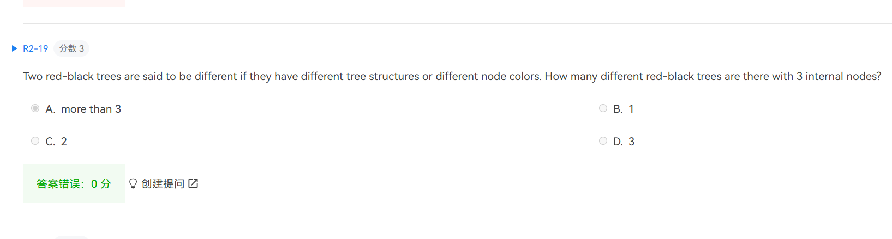

$73 \rightarrow 82$

1. 仅对于针对amortized设计的数据结构是这样。

   对于普通数据结构，频繁操作一个最坏情况，均摊不会变好。例如普通BST

   Expected $\leq$ amortized $\leq$ worst

   

2. **Full** binary tree vs **Complete** binary tree

   Full means every internal node is full

   

3. $O(logN)$

   

4. 看起来就是坑

   

5. NF must no improvement

   FF 1.5

   若$a > b \geq 0.5$, FF的解就是最有解。

   若$b \leq 1/3$, 那么最多有一个箱子容量少于$1-b$, 否则之前放b的时候就能放到前面不足$1-b$的箱子里，算出1.5倍近似

   若$0.5>b > 1/3$, $a + b > 2/3$ 每个箱子也都至少2/3满，（不到2/3说明里面只放了一个东西）

   

6. ?

   

7. All NP problems can reduce to NPC problems

   $O(N^2) = O(N^3)$ 

   

8. ?

   

9. ?

   