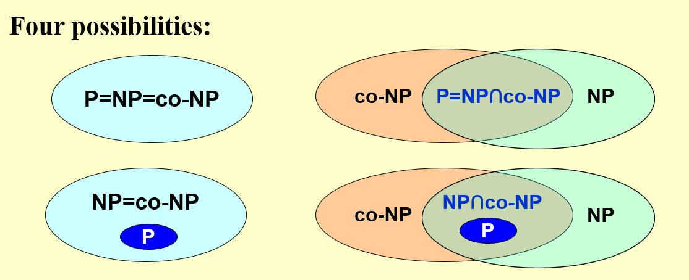

# NP Completeness

#### Decision Problems

The following discussion are all around decision problem.

An optimization problem can be converted to decision problem.

#### Formal Language

A language $L$, consisting instances of a problem.

e.g. In Hamilton cycle problem, $L$ = all Hamilton graphs.

$x \in L$ in one of the Hamilton graph.

#### Accept

An algorithm $A$ accept language $L$, if it accepts all $x \in L$.

An algorithm $A$ decides language $L$, if it accepts $L$ and correctly rejects $x \notin L$. (some algorithm will enter infinite loop thus can only accept but not decides $L$)

#### Verify

Certificate $y$. (Possible solution to prove $x \in L$)

An algorithm $A$ can decides $L$ if $\forall x\in L, \exist y, A(x,y) = 1$.

#### Complexity class NP

Those $L$ that can be **verified** in polynomial time.

Those $L$ can be solved in polynomial time in **non-deterministic** machine

#### NPC

$\forall A_{NP} \rightarrow_{polynomial reduce} B_{NPC}$

If we want to prove problem $A$ is NPC, then $A$ should be on the **right** side.

Reduce means **no harder than**.

#### co-NP

$\bar L \in NP$

#### Relations

$P \subset NP, P \subset co-NP$ **always holds.**

Not decided yet:

1. If $L \in NP$, $\bar L \in NP$ ?

   If $L \in NP \rightarrow \bar L \in NP$ holds, this means $L \in NP \iff L \in co-NP$ 

2. $P = NP$ ($P = NP \cap co-NP$) ? 

#### Classical NP-problems

* Clique problem

  Find a complete subgraph with K vertices

* Vertex Cover problem

  Find a vertex set with K, covers each edge.

* Circuit SAT

* Hamilton cycle

  Travel each node once

* TSP

  If the cost of TSP doesn't satisfies triangle inequality, there are no approximation algorithms.

  