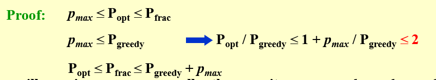

# Approximation

#### Approximation ration

$C/C^*$ = $\rho (n)$ = $1+\epsilon$

* $\rho(n)$ or $(1+\epsilon)$ - approximation

* fully polynomial-time approximation scheme (FPTAS)

  Polynomial w.r.t. $\epsilon$

#### Bin Packing

How to analyze? Construct the **lower bound** of each bin.

Suppose $\sum w_i = W$, optimal solution $C^*$. Obviously, $C^* >= W$ (all bins are full)

* **Next Fit**

  $2$ -approximation, never uses more than $2M-1$ bins, where $M$ is the optimal solution.

  Proof:

  For Next Fix strategy, each bin is at least half full.

  $W = \sum w_i \geq C * 1/2$

  $C \leq 2W \leq 2C^*$

* **First Fit**

  $1.7$-approximation

* **Best Fit**

* **Best Fit - Decreasing** (Offline)

  Sort. Large things first.

#### Knapsack Problem

$2$-approximation

If we use dp, $O(n^2p_{max})$

#### K-center Problem

2-approximation

We can test if $r$ is valid by drawing circle with $2r$

**No approximation ration less than $2$ , unless P=NP**

#### How to Prove an Approximation Ratio?

For the optimal solution $C^*$, we consider its lower bound. $C^* \geq X$.

Then, we associate our solution $C$ with $X$. (Consider the best case or constraints).

#### How to Disapprove an Approximation Ration Under $\rho$

Reduce an NPC problem to this problem.
