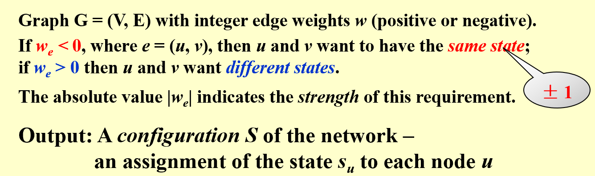
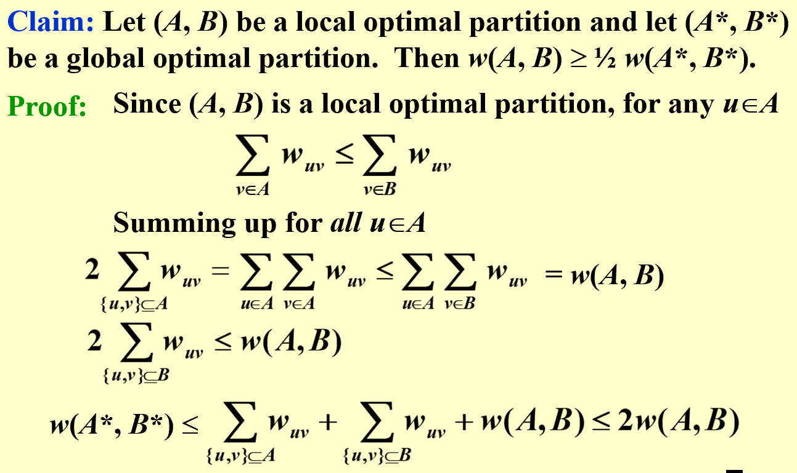

# Local Search (Approximation cont.)

#### Local

* A **feasible** set of neighborhoods
* Local optimum

#### Search

* Start with **feasible solution**, and find a better one.
* Stop when no (or little) improvement

#### Vertex cover

* Start with all vertices
* Delete a potential vertex, which makes the remaining set also feasible
* May be add a chance to add a vertex ($e^{-\delta_{cost}/kT}$), $T$ keeps cool down

#### Simulated Annealing

#### Hopfield Neural Networks

* Assign states of each node

* Edge are constraints and reward

  

  All edge constraints may not be satisfied, but all nodes are **stable**.

* A stable node

  $\sum w(e)_{good} \geq \sum w(e_{bad})$

* We flip a node if it's not stable

  A flip will surely increase the total gain.

  Total gain has upper bound.

  There **always a solution** that all nodes are stable.
  
  Local search **is not polynomial**. It has at most $\sum w_i$ iterations.

#### Maximum cut problem

Special case of hopfield neural networks, with positive edge weight. (only nodes belong to different group, we gain the reward)

* 2-Approximation (**may not polynomial**)

  

* $2+\epsilon$ approximation

​	Only flip when gain is at least $(2\epsilon/|V|) * w(A,B)$

​	$(2+\epsilon)w >= w^*$

​	$O((n/\epsilon) logW)$ flips

$f'(k) = 1/Nln(N/k) + -1/N = 1/N*(ln(N/k) - 1)$

$N/k = e$, $k = N/e$ 

 