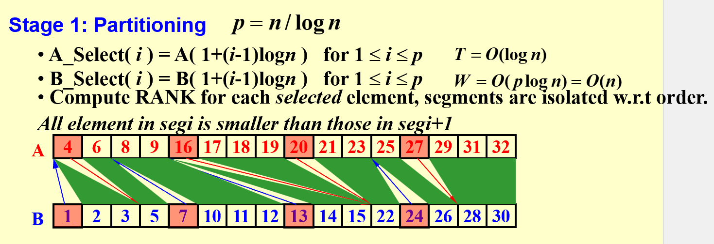

# Parallel Algorithms

* **PRAM (Parallel Random Access Machine)**

  Needs to fully specify allocation of instructions. (e.g. who is idle)

* **WD (Work Depth)**

* **T(n)**

  Worst case running time on PRAM. Theoretical minimum time.

* **W(n)**

  Total work load of all processors

* **P(n)**

  Number of processes $P(n) = W(n)/T(n)$

* **WD running time**

  In a WD mode, time is $O(T(n) + W(n)/P(n))$

#### Summation

Balanced tree. $T(n) = O(logn), W(n) = O(n)$

#### Prefix Sum

First buttom up compute the summation.

Then top-down reduce the prefix sum.

$C$ is the summation to the rightmost descendant of this node.

Left child : $C = Sum + Sum_{uncle}$

Right child: $C = C_{parent}$

#### Merging

Merging is equivalent to ranking.

Ranking the element in the other sequence.

* **Partition**

  Partition to $log n $ segments. Total at most $2*(n/logn)$ segments to be ranked.

  $T(n) = O(logn), W(n) = O((n/logn)*logn) = O(n)$

  

* **Ranking**

  $T(n) = O(logn), W(n) = O(n)$

#### Maximum-Finding

* **Binary tree**

* **$n^2$ Comparison**

  $W(n) = O(n^2),T(n) = O(1)$, Too much work load, not good.

* **$\sqrt n $ Recursive Partition, $n^2$ comparison reduction**

  Partition to $\sqrt n$ segment. Using $n^2$ comparison to do reduction.

  $T(n) \leq T(\sqrt n) + O(1) = O(loglogn)$

  $W(n) \leq \sqrt n W(\sqrt n) + (\sqrt n)^2 = O(nloglogn)$

* **$loglogn$ Partition, $\sqrt n$ reduction**

  Partition to segment of length $loglogn$. Total $n/loglogn$ segments。

  Each segment use serial max-finding.

  $T(n) \leq loglogn + loglog(n/loglogn) = O(loglogn)$

  $W(n) \leq n + (n/loglogn) * loglog(n/loglogn) = O(n)$

#### Random Sampling

Has a high probability run in $T(n) = O(1), W(n) = O(n)$

The probability no finishing at one time is $O(1/n^c)$

$T(n) = \sqrt n T(\sqrt n) + O(n)$

