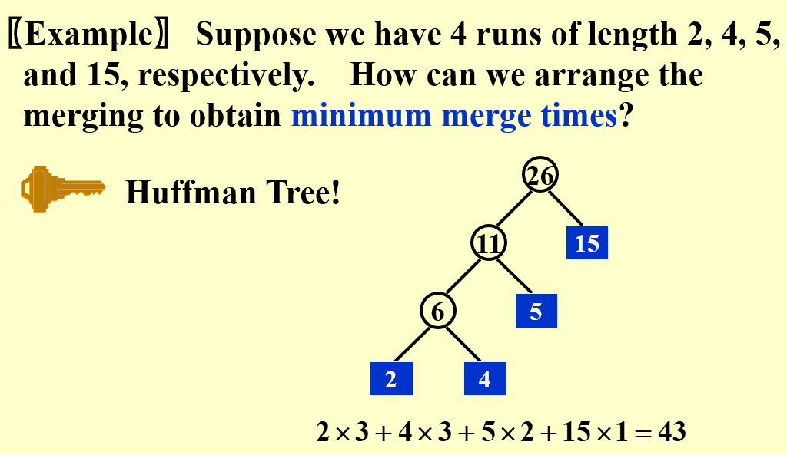

# External Sorting

#### External Merge Sort

* **N:** Total number of records

* **M:** Number of records can be held in memory

* **k:** k-way merge

  use a $k$ size heap

  require $2k$ external memory

* **Number of passes**

  $1 + log_k(N/M)$ , 1 for initial partition and sorting

#### Poly-phase Merge

Use $k+1$ external memory.

Initial partition should be to consecutive Fibonacci number. So it can bouncing.

#### Parallel Merge

Computation & Memory access overlap!

$2k$ input buffer and $2$ output buffer

#### Replacement Selection

#### Minimize Merge Time

