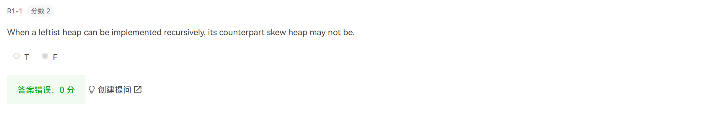
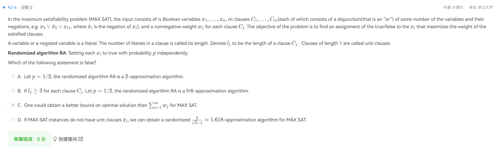
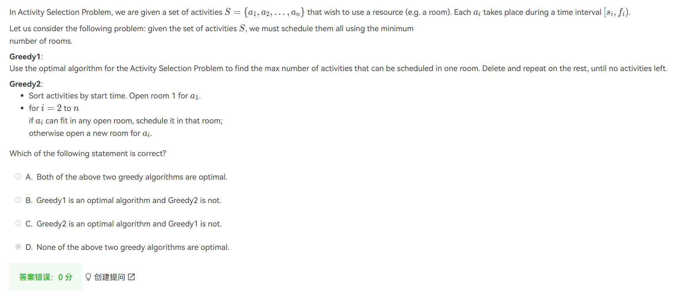
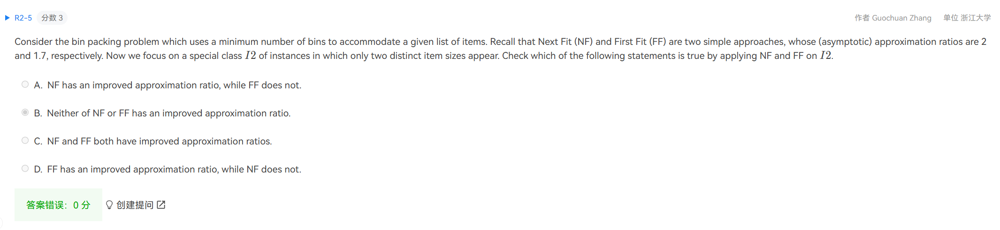
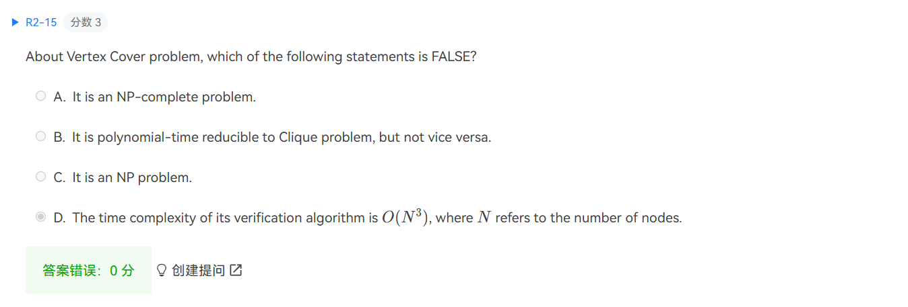
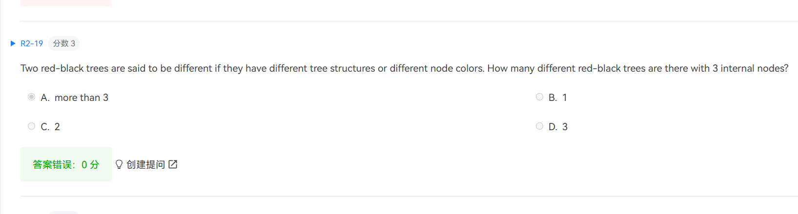
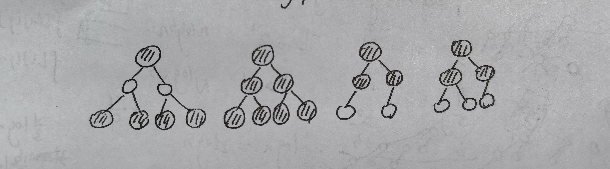
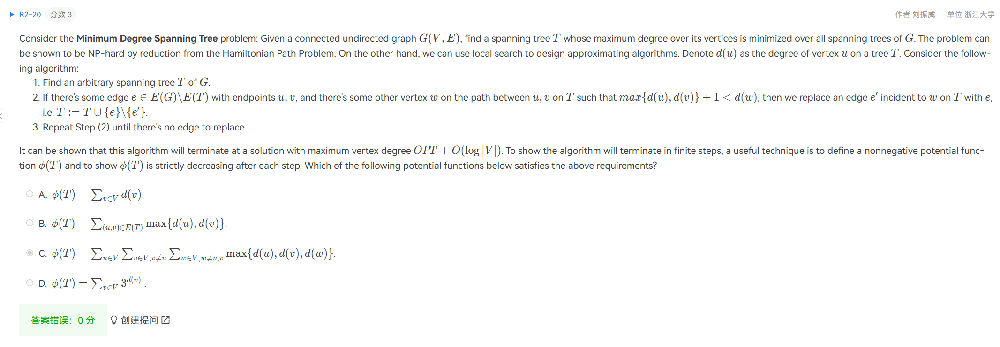

1. ?

   

2. 看不懂在说什么

   

3. 看不懂在说什么

   

4. ？

   

5. BD正确的复杂度应该是什么

   

6. ？

   

7. 期望都是$O(n)$了，连续多次操作均摊难道不是$O(n)?$

   \

8. 感觉题目表述不清，我以为他说当前neighbourhood里由global optimum？

   

9. NF must no improvement

   FF ?

   

10. 总操作数不是$Nlogk$？然后把N看作固定值

    

11. B我知道是错的了，但D不可以$O(N^2)$ 解决吗，就是遍历每个点，标记他的出边，最后检查有没有边没被标记?

    

12. ?

    

    我这至少画了4种

    

13. ?

    

    

    

    