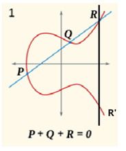

# 考试内容

* 理论50min，60分单选题
* 实验80min
  * 2道函数题（DES，AES）
  * 2道程序填空（RSA，ECC）

- [x] 古典密码 （单表加密，多表加密，仿射密码）
- [x] 加法逆元，乘法逆元
- [x] enigma （各种部件，原理）
- [x] MD5，sha1 （重点是填充）
- [x] 流密码rc4 （要知道代码怎么写）
- [x] 分组加密
- [x] DES，sbox查询，密钥生成，加密解密流程
- [x] AES，mul column，农夫算法，加密解密流程
- [x] RSA，加密解密签名验证
- [x] ECC，点加点乘计算，加密解密签名验证

# 数学基础

* **整除**

  若存在整数k使得b=a*k，则称a整除b，记作a|b。

* **素数与互素**

  gcd(a,b)=1

  任一整数a(a>0)都能唯一分解成以下形式:
     $a = p1 * p2 * p3 * ... * pt$
  其中$p1、p2、p3、...、pt$是素数。

* **最大公约数(greatest common divisor)**

  $d=gcd(a,b)$，则一定存在整数$x、y$使得下式成立:

  $$a*x + b*y = d$$

* **模(mod)运算和同余(congruent)**

  $a=b+n*k$(k为整数)，我们称

  a、b对于模n同余(a is congruent to b mod n)，

  记作: $a ≡ b (\bmod n)$

  * 当且仅当 $b≡a (\bmod n)$时, 有$a≡b (\bmod n)$
  * 若$a≡b$ 且 $b≡c (\bmod n)$，则一定有$a≡c (\bmod n)$
  * 若$a≡b (\bmod n)$且$c≡d (\bmod n)$，则有
       $a+c≡b+d, a-c≡b-d, a*c≡b*d (\bmod n)$

* **逆元**

  1. **加法逆元**

     若a+b≡0 (mod n), 则称a是b的加法模n逆元，b是a的加法模n逆元。

     加密过程: y = (x+3) % 26
     解密过程: x = (y+23) % 26， 23是3的加法逆元

  2. **乘法逆元 ! ! !（代码怎么写）**

     若$a*b≡1 (\bmod n)$, 则称a是b的乘法模n逆元，b是a的乘法模n逆元。$a$的乘法逆元记作$a^{-1}$

     * 求解乘法逆元(扩展欧几里得)

       $13 * x ≡ 1 mod(35)$

       $gcd(13, 35) = 1 \rightarrow 13*x + 35*y = 1$

       $35=2*13+9$ , $13=1*9+4$, $9=2*4+1$ 

       $1 = 9-2*4$, 再将9和4逐步由上式替换

# 古典密码

* **单表密码**

  明文密文有固定对应关系，容易被频率分析

  * **加法密码 （凯撒密码）**

    解密时加上加法逆元

  * **乘法密码**

    解密时乘上乘法逆元

  * **仿射密码**

    $y = (x*k1 + k2) \bmod n$

    $x = (y-k2)*k1^{-1} \bmod n$

* **多表密码**

  每个明文字母可能采用不同的单表加密

  $y = (x+k_i) \bmod n$
  $x = (y-k_i) \bmod n$, $i$ 为第i张表

  :cry: **Enigma**

  输入明文后齿轮先转动再查表：

  1. 先通过接线板plugboard （打乱）

     $\mathcal A \leftarrow plug[\mathcal A]$

  2. 通过右侧第一个齿轮

     Message Key为齿轮外部设置（外部展示的字母）

     Ring Setting为内部设置

     $\delta = MessageKey - RingSetting$

     $\mathcal A \leftarrow (rotor[(\mathcal A + \delta)\bmod26] - \delta)\bmod26$

  3. 通过右2、3齿轮

  4. 通过反射板reflector

     反射板输入输出不会相同，由此推出enigma明文密文不同。

  5. 反向通过右3齿轮

     $\delta = MessageKey - RingSetting$

     $\mathcal A \leftarrow (rotor^{-1}[(\mathcal A + \delta)\bmod26] - \delta)\bmod26$

  6. 通过右2、1齿轮，接线板

  5个齿轮的进位：$QEVJZ \rightarrow RFWKA$

  double stepping: 右2齿轮再即将进位位置，不管右1是否进位，都将带动右2旋转

# Hash 函数

* **MD5**

  摘要，有损压缩

  * $M_1=m_0+m_1$       $M_2=m_0+m_2$
    当$md5(m_1)==md5(m_2)$时，有
    $md5(M_1) == md5(M_2)$

  * 分块计算，每块64 bytes。

    **末尾填充：**0x80, (0x00)*, 8字节message总**位数**（不含填充，小端）

    0x80必须有，0x00可以没有，至少需要9bytes

    最后一块字节数 $\geq 56$ 时，需要开辟新的一块

    最后一块字节数$\leq 55$ 时，直接在当前块填充即可

  * **彩虹表破解md5**

    计算长为n个字母的彩虹表，$P(n)$ 表示第$n$种排列
    
    ```c
    for(i=1; i<BigNum; i++){
    	n0 = rand();
    	m[0] = MD5(P(n0));
    	for(int j=1; j<=100; j++){
    		nj = m[j-1] mod 26^4;
    		m[j] = MD5(P(nj));
    	}
    	DB_Insert(m[100], n0);
    }
    ```
    
    查找M是由什么生成的：
    
    ```c
    int n0;
    while(!DB_Query(M, n0)){
    	ni = M mod 26^4;
    	M = MD5(P(ni));
    }
    // 拿到n0，然后按计算彩虹表流程，算出M对应的n
    ```

* **SHA**

  sha-1散列算法计算出来的hash值达160位，即20字节，比md5多了32位

  64字节分块计算，填充方式与MD5相同

# 分组密码与流密码

* **电子密码簿ECB(Electronic codebook)**

  > 明文被分成长度相等的段(64 bit)，每段分别用**同样方式**加密。

  缺点：相同的明文段密文相同。优点：可以并行处理

  加密过程：$C_j = E_k(P_j)$ （$k$为密钥， $P_j$为第$j$段明文，$C_j$为第$j$段密文）
  解密过程：$P_j = D_k(C_j)$

* **密文块链接模式CBC(Cipher block chaining)**

  > 第$j$块(64 bit)明文的加密与第$j-1$的密文相关

  加密过程：  $C_j = E_k(P_j ⊕ C_{j-1})$ 
  解密过程：  $P_j = D_k(C_j)⊕ C_{j-1}$

* **密文块反馈CFB(Cipher block feedback)**

  > 8 bit 块大小，解密时可以从密文的错误中恢复，密文某处的错误只有有限的影响范围

  - **加密过程**

    先初始化64 bit$X_1$

    $C_j = P_j ⊕ E_k(X_j)[63:56]$

    $X_{j+1} = \{X_j[63:8], C_j)$

  - **解密过程**

    $P_j = C_j ⊕ D_k(X_j)[63:56]$
    $X_{j+1} = \{X_j[63:8], C_j)$  

    由于$X$每轮左移8位，所以错误的密文在8轮后就会被移走，从而从错误中恢复

* 表格

  |      | 加密方法                                                     | 加密块大小 |
  | ---- | ------------------------------------------------------------ | ---------- |
  | ECB  | 对明文分块加密， $Cipher_j = Encrypt_k(\mathbf {Plain\_text_j})$ | 64 bits    |
  | CBC  | 对明文和上一段密文共同加密，$Cipher_j = Encrypt_k(\mathbf {Plain\_text_j}⊕ \mathbf {Cipher_{j-1}})$， 第一段用IV | 64 bits    |
  | CFB  | 对IV加密，$Cipher_j = \mathbf {Plain\_text_j} ⊕ Encrypt_k(\mathbf {X_j})[63:56]$ IV加密后，取高8位异或明文，更新IV的低8位 | 8 bits     |

* **流密码RC4**

  * **Prepare key** 共256bytes

    Init $s[i] = i, i \in [0,256)$

    ```cpp
    for(int i=0, j=0; i<256; i++){
    	j = (j + s[i] + seed[i%seed_len]) % 256;
    	swap(s[i], s[j]);
    }
    ```

  * **Encrypt/Decrypt (byte-wise)**

    对明文的处理仅仅是异或其中一个key
    
    操作全在key上
    
    ```cpp
    for(int i=0, j=0; i<input_len; i++){
    	j = (j + s[i%256]) % 256;
    	swap(s[i%256], s[j]);
    	xor_index = (s[i%256] + s[j]) % 256;
    	input[i] ^= s[xor_index];
    }
    ```

# DES

> 密钥太短（64 bit 密钥实际56 bit被使用）
>
> 受差分分析攻击
>
> sbox未公开，可能有后门

共**16**轮（左右部分分别被加密8次）（位的编号为大端）
单字节，不分大小端，都是左边高位，右边低位

* **密钥的处理**

  * 原密钥64 bit -> 56 bit

    通过`key_perm_table` 函数计算得到$\mathcal K_0$

  * 每轮加密密钥的计算

    左28位和右28位分别循环左移指定位数，然后查表缩减为48位

    $\mathcal K_i = to48(rol(\mathcal K_0[55:28], key\_rol\_steps[i]), rol(\mathcal K_0[27:0], key\_rol\_steps[i]))$

* **加密过程**

  先对明文打乱（initial permutation）

  执行16次循环，奇数轮对左边加密

  ```c
  des_encrypt()
  {
  	for(i=1; i<=16; i++){
          if(i%2 == 1){ //奇数轮对左边加密
              L[i] = L[i-1] ^ f(K[i], R[i-1]); // K为第k轮的48bit密钥
              R[i] = R[i-1];
          }else{
              R[i] = R[i-1] ^ f(K[i], L[i-1]);
              L[i] = L[i-1];
          }
  	}
      swap(L[i], R[i]);
  }
  ```

  * f 函数

    1. 进入明文为32 bit，先扩充为48 bit，与密钥等长

    2. 明文与密钥异或（8组，每组6 bit）

    3. 6 bit一组，共8组。分别进入sbox，获得8组4 bit结果，共32 bit

       **sbox查询**

       `sbox[8][64]` (`sbox[8][4][16]`)，第一维即为组的编号，将每组（6bit）换算后，带入第二维。
    
       例：第零组为`6'b1_0011_0`, 则`sbox[0][6'b10_0011]`或 `sbox[0][2'b10][4'b0011]`
    
       sbox输入6 bit，输出4 bit
    
    4. 32 bit结果再次打乱

  对密文反打乱（final permutation）

* **差分分析** :innocent:

  差分分析**对于加密轮数少**的情况试用，加密轮数多了，计算量没有显著减少

  假设只加密三轮，我们知道任意明文对$L_0, R_0$ 和密文对 $L_3, R_3$

  1. 第一轮

     $L1 = L0 \oplus f(R0, K1), R1 = R0$

  2. 第二轮

     $R2 = R1 \oplus f(L1, K2), 
     L2 = L1$

  3. 第三轮

     $L3 = L2 \oplus f(R2, K3) = L1 \oplus f(R2, K3) = L0 \oplus f(R0, K1) \oplus f(R2, K3)
     L3 = L0 \oplus f(R0, K1) \oplus f(R3, K3)$

     此时只有K是未知，开始差分分析

  * 改变$L_0$， $R_0$不变

    $L3 = L0 \oplus f(R0, K1) \oplus f(R3, K3)$

    $\tilde L3 = \tilde L0 \oplus f(\tilde R0, K1) \oplus f(\tilde R3, K3)$

    $L3 \oplus L3 
    =(L0\oplus \tilde L0) \oplus (f(R0, K1) \oplus f(\tilde R0, K1)) \oplus (f(R3, K3)\oplus f(\tilde R3, K3))$

    $=(L0\oplus \tilde L0) \oplus (0) \oplus (f(R3, K3)\oplus f(\tilde R3, K3))$

    $=L0’ \oplus f(R3, K3)\oplus f(\tilde R3, K3)$

    $=L0’ \oplus sbox(E(R3)\oplus K3)\oplus sbox(E(\tilde R3)\oplus K3)$

    $sbox(E(R3)\oplus K3)\oplus sbox(E(\tilde R3)\oplus K3) = sbox(E(R3)\oplus E(\tilde R3) )$已知

    这时根据各种限制条件，枚举$E(R3) \oplus K3$ 即可

# AES

* **有限域$GF(2^n)$**

  域中的元素，可表示为多项式$f(x) = a_{n-1}x^{n-1} + a_{n-2}x^{n-2} + … + a_1x + a_0$, 其中$a_i \in \{0,1\}$

  也可表示为一个$n$位二进制数$\{a_{n-1}, a_{n-2}, \dots,a_0\}$。

  * **加法**

    $a(x) + b(x) = (a(x) + b(x)) \bmod p(x)$, $p(x)$是不可约多项式.

    等同于$\sum_0^{n-1} (a_i\oplus b_i)x^i \bmod p(x)$

  * **乘法**

    $a(x) * b(x) = (a(x) * b(x)) \bmod p(x)$, $p(x)$是不可约多项式

    模拟二进制竖式乘法，加法遵循有限域规则

    * **农夫算法**（8 bit, mod 0x11B）

      ```c
      // input x, y (8 bit), p = x * y
      unsigned int p = 0; /* the product of the multiplication */
      int i;
      for (i=0; i < 8; i++)
      {
        if (y & 1) /* if y is odd, then add the corresponding y to p */
           p ^= x; /* since we're in GF(2^m), addition is an XOR */
        y >>= 1;   /* equivalent to y/2 */
        x <<= 1;   /* equivalent to x*2 */
        if (x & 0x100) /* GF modulo: if x >= 256, then apply modular reduction */
           x ^= 0x11B; /* XOR with the primitive polynomial x^8 + x^4 + x^3 + x + 1 */
      }
      ```

  * **逆元**

    一个元素的加法逆元就是他本身.

    $\sum_0^{n-1} (a_i\oplus a_i)x^i \bmod p(x) = \sum_0^{n-1} 0 *x^i \bmod p(x) = 0$

* **加密流程**

  明文长度128bit，密钥长度128bit（循环10轮）、192bit（12轮）、256bit（14轮）

  * **密钥生成（128bit）**

    每16byte为一组生成，最开始16byte为种子密钥。共11组（包含种子）

    设$i ≡ 0 \bmod 4$, k 是4 byte大小

    1. $k[i] = k[i-1]$

    2. $rol(k[i], 1\_byte)$

    3. $ByteSub(k[i])$  k[i] 每个字节过sbox
    4. $r = 2^{(i-4)/4} \bmod 0x11B$ (有限域乘法) 查表：`0x01 0x02 0x04 0x08 0x10 0x20 0x40 0x80 0x1B 0x36`
    5. $k[i]$ 首字节 异或 $r$
    6. $k[i] \oplus k[i-4]$
    7. $k[i+1] = k[i] \oplus k[i-3], k[i+2] = k[i+1] \oplus k[i-2], k[i+3] = k[i+2] \oplus k[i-1]$

  * **加密**

    第0轮，只做AddRoundKey（明文与密钥异或）

    ```c
    for(i=1; i<=key_rounds; i++)
    {  
      /* 第1至key_rounds轮, 做以下步骤: ByteSub, ShiftRow, MixColumn, AddRoundKey */
      
      /*
      	p[j] = sbox[p[j]];
      */
      ByteSub((unsigned char *)matrix, 16);
      
      /*
        将matrix中元素，以列主序排列 （相当于转置）
      */
      my_MixColumnInverse((unsigned char *)matrix, a, 0); /* 不做乘法, 只做矩阵行转列 */
      
      /*
      	对矩阵每行左移 i-1 字节
      */  
      ShiftRow((unsigned char *)matrix);
        
      /*
      	最后一轮不做乘法
      */
      if(i != key_rounds)
         MixColumn((unsigned char *)matrix, a, 1); /* do mul */
      else
         MixColumn((unsigned char *)matrix, a, 0); /* don't mul */
        
      /*
      	明文密钥异或
      */
      AddRoundKey((unsigned char *)matrix, key+i*(4*4));
    }
    ```

    * **MixColumn**

      取矩阵的**每一列**与 3 1 1 2 做多项式乘法($\bmod x^4 + 1$)，其中系数乘法遵循有限域规则

      解密乘 B D 9 E

      $\left[ \begin{array}{} 2 & 3 & 1 & 1\\ 1 & 2 & 3 & 1 \\ 1 & 1 & 2 & 3 \\ 3 & 1 & 1 & 2 \end{array} \right] * \mathbf{col}$

    

# RSA

* **基本元素**

  * 大素数 $p,q$
  * $n = p*q$
  * $e$ (通常为10001，应与$(p-1)(q-1)$互素) 
  * $d = e^{-1} \bmod (p-1)(q-1)$
  * 公钥 $(e, n)$
  * 私钥$(d, n)$

* **加密**

  $c = m^e \bmod n$

* **解密**

  $m = c^d \bmod n$

* **明文的处理**

  明文$m$与$n$位数相同，且要求$m < n$. 要不然mod后信息就没了。

  通常做法是，第一个字节填0，真正的明文后移。

  TODO：PKCS1

* **签名**

  创建签名：$RSA(MD5(m), private\_key)$

  检查签名：$RSA(Signature, public\_key) == MD5(m)$

  > 签名用私钥加密，公钥解密，因为需要任何人都能验证。
  >
  > 加密用公钥加密，私钥解密，因为只想要一个人能看到。
  
* **相关接口**

  ```cpp
  // 大数相关
  BIGNUM *pn;
  pn = BN_new();
  BN_CTX *ctx = BN_CTX_new();
  // RSA 结构
  RSA *prsa = RSA_new();
  prsa->flags |= RSA_FLAG_NO_BLINDING;
  prsa->n = pn; // 设置n
  prsa->e = pe; // 设置公钥
  prsa->d = pd; // 设置私钥
  /*
  * 密钥生成
  * key_bits为n长度，是pq长度的两倍
  */
  RSA *prsa = RSA_new();
  prsa = RSA_generate_key(key_bits, 0x10001, NULL, NULL);
  /*
  * 公钥加密
  * flen是要加密的明文长度
  * 私钥加密同理
  */
  n = RSA_size(prsa); // RSA modulus size
  // 无填充，明文长度最大为RSA_size
  RSA_public_encrypt(flen, bufin, bufout, prsa, RSA_NO_PADDING); // 公钥加密
  RSA_private_decrypt(flen, bufin, bufout, prsa, RSA_NO_PADDING); // 私钥解密
  // PKCS1 填充，明文长度最大为RSA_size - 11
  RSA_public_encrypt(flen, bufin, bufout, prsa, RSA_PKCS1_PADDING); // 公钥加密
  RSA_private_decrypt(flen, bufin, bufout, prsa, RSA_PKCS1_PADDING); // 私钥解密
  ```

* **调用大数库实现加密解密**

  ```cpp
  BN_CTX *ctx = BN_CTX_new();
  BN_bin2bn(bufin, n, pin); // 长为n的大端格式数bufin 转大数pin
  BN_mod_exp(pout, pin, pe, pn, ctx); // pout = pin^pe mod pn 大数带余乘方
  BN_bn2bin(pout, bufout)； // 大数转大端bufout
  ```

# ECC

* **椭圆曲线的运算规则**

  定义$\mathcal O$ 为零元素，$P+\mathcal O = P, \mathcal O +P = P$

  

  $P+Q=R', R+R' = \mathcal O$

  $\exist n, \sum^n P = n*P=\mathcal O$, $n$ 就是$P$ 的阶。 曲线上点的个数就是曲线的阶。

  当$k$很大时，对于$Q=k*P$, 求$k$很困难。

* **决定椭圆曲线的6要素**

  * **方程参数 $a, b, p$**

    $y^2 = x^3 + ax + b (\bmod p)$

  * **基点$G$**, (曲线上随便选一个)
  * **$G$的阶**
  * **余因子** （$G$的阶/基点的阶，通常为1，即基点所在子群等于原来的群）

* **加密解密**

  私钥：随机数$d$

  公钥：$R = d * G$

  * **加密**

    $r = k * G$， 不可求模

    $s = m * (k * R)$ ($s = m*(d * r)$)

    $\{r.x, (s.x)\bmod n\}$组成密文

  * **解密** （r.y 随便选一个）

    $m = (s.x/(d*r).x )\bmod n$

* **签名**

  * **ecdsa**

    - 签名

      $r = ((k*G).x) \bmod n$

      $s = (m+r*d)/k$， 不可求模

    - 验证

      $((m/s)*G+(r/s)*R).x == r$

  * **ecnr**

    * 签名
    
      $r = (k*G).x + m \bmod n$
    
      $s = k-r*d \bmod n$, 可以求模，因为验证时$s*G = (s \bmod n)*G$
    
    * 验证
    
      $r - (s*G+r*R).x == m$

* **相关接口**

  ```cpp
  EC_GROUP *group = EC_GROUP_new(EC_GFp_mont_method()); // 新建群
  EC_GROUP_set_curve_GFp(group, p, a, b, ctx); // 设置曲线方程参数
  G = EC_POINT_new(group); // 分配一个曲线上的点，仅分配空间
  EC_POINT_set_affine_coordinates_GFp(group, G, gx, gy, ctx); // 根据gx, gy设置点G坐标
  EC_POINT_set_compressed_coordinates_GFp(group, G, gx, 0, ctx); // 设置点G坐标(仅输入gx)
  EC_POINT_get_affine_coordinates_GFp(group, T, tx, ty, ctx); // 将点坐标输出到大数
  /*
  * 设置group生成元，最后一个参数为余因子，一般为1
  */
  EC_GROUP_set_generator(group, G, n, BN_value_one());
  EC_POINT_set_to_infinity(group, T); // 将T设置为无穷远点
  /*
  * 点加 T = T + G
  */
  EC_POINT_add(group, T, T, G, ctx);
  /*
  * 点乘
  * r = G*m + P*n.
  * 若m,p,n有null，对应的项不做计算。
  * G为生成元
  */
  EC_POINT_mul(const EC_GROUP *, EC_POINT *r, const BIGNUM *m, 
               const EC_POINT *P, const BIGNUM *n, BN_CTX *ctx);
  
  EC_GROUP_free(group); // 释放群
  
  BN_mod_inverse(tx, tx, n, ctx); // 大数带余求逆
  ```

