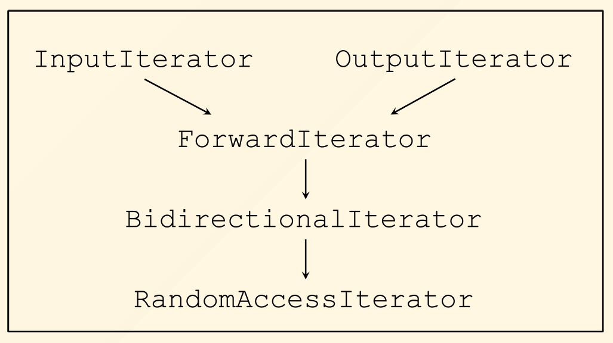

# Iterators

> Iterator, a generic pointer. (Pointer to element in containers)

#### Basic Element of an Iterator

* **begin()**

  Point at the first element in the container

  ```cpp
  vector<int> v = {1,2,3,4,5};
  auto it = v.begin(); // it -> 1
  ```

* **end()**

  Point at the element **after** the last element. 

  $element \in [begin(), end)$

* **operator ++**

  Step the iterator to next element

  ```cpp
  vector<int> v = {1,2,3,4,5};
  auto it = v.begin(); // it -> 1
  it++; // it -> 2
  ```

* **operator ***

  Get the element pointed to.

  ```cpp
  vector<int> v = {1,2,3,4,5};
  auto it = v.begin(); // it -> 1
  *it == 1;
  ```

* **operator ->**

  Get the 'real' pointer to the element.

  

#### Iterator Traits

Defines info about the iterator

```cpp
template <class Iterator>
struct iterator_traits {
 typedef typename Iterator::value_type value_type;
}
```

Partial specialization for pointer types

```cpp
template <class T>
struct iterator_traits<T*> {
 typedef T value_type;
}
```

* **Standard traits**

  *  iterator_category

  *  value_type

    type of elements in container

  * difference_type

    type of `it1 - it2`

  * pointer

    type of pointer to elements on container

  * reference

    type of reference to elements on container

#### Iterator Category

* **Inheritance tree**

  

* **Call corresponding functions regarding iterator category**

  ```cpp
  template<class Iterator, class Distance>
  inline void advance(Iterator &i, Distance n)
  {
  	__advance(i, n, 
  	iterator_traits<Iterator>::iterator_category());
  }
  ```

  Call functions with an instance of `iterator_category`.

  `__advance` have several overloaded versions, differed by the last argument.

  Compilers will then choose appropriate function signature !