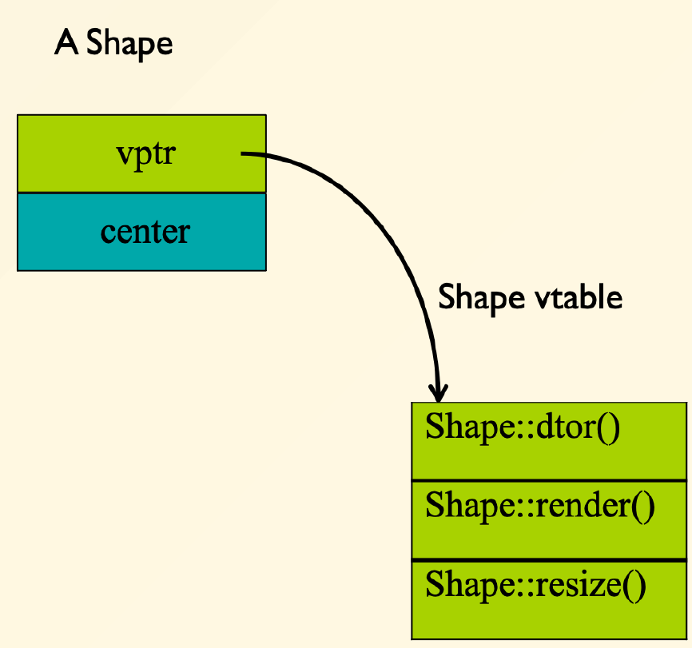

# Polymorphism

#### Virtual Function Table



* **operator =**

  Not copied

  ```cpp
  Ellipse elly (20f, 40f);
  Circle circ(60f);
  elly = circ;
  ```

  Only part of circ that fits elly are copied.

  vtable **is not copied**.

* **Pointer =**

  vtable **is copied**.

* **Reference =**

  vtable **is copied**.

  Think reference as **alias**!

* **Dtors can be virtual**

  **Note :** The ancestors' Dtors are also called.

  ```cpp
  class A{
      public:
      A(){}
      virtual ~A(){cout << "A::~A()" << endl;}
  };
  
  class B : public A{
      public:
      B(){}
      ~B(){cout << "B::~B()" << endl;}
  };
  
  B b();
  
  /* Output:
   * B::~B()
   * A::~A()
  */
  ```

* **Key Word 'override' **

  This keyword let compilers to check if the overrode function has the same signature(e.g. argument list).

  If the overrode function is not exited in the base class (**denoted as virtual**), **compile error**.

  ```cpp
  // Compile error
  class A{
  public:
      void f(){}
  };
  
  class B : public A{
  public:
      void f() override {}
  };
  ```

  ```cpp
  // Compile error
  class A{
  public:
      virtual void f(){}
  };
  
  class B : public A{
  public:
      void f(int x) override {}
  };
  ```

  **Override multiple signatures**

  If you override an overloaded function, you must override all of the variants!
  If not, **others will be hidden**

  ```cpp
  class A{
      public:
      virtual void f(){}
      virtual void f(int x){} // Hidden in B
  };
  
  class B : public A{
      public:
      void f() override {}
  };
  
  B b;
  b.f(1); // Compile error
  
  A *a = new A();
  B *b = reinterpret_cast<B*>(a); // 'Down cast', needs reinterprete_cast
  b->f(1); // Also compile error, even if 'pointer =' preserve vptr
  ```

* **Return Type Relaxation**

  **Only applied** for pointers and references

  ```cpp
  class A{
  public:
      virtual A* f1(){}
      virtual A& f2(){}
      virtual A f3(){}
  };
  
  class B : public A{
  public:
      B* f1() override {} // Good
      B& f2() override {} // Good
      B f3() override {} // Compile error
  };
  ```

* **Abstract class**

  Define interface **without** defining an implementation.

  * Pure virtual function

    ```cpp
    virtual func(args...) = 0; // Pure virtual
    virtual func(args...); // Not pure virtual !
    ```

    Must be implemented in derived class.

    Destructor can not be pure virtual but with empty body.

  * Only static members

  * Static member functions

  

