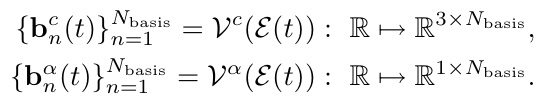
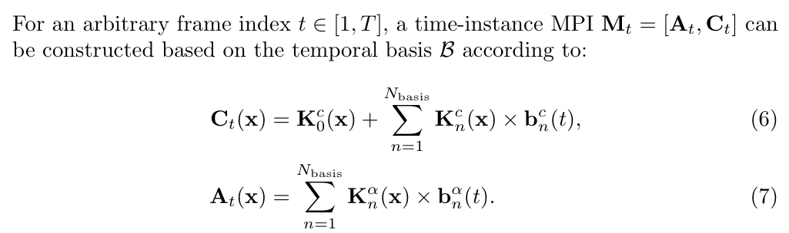

# :heart_eyes:Temporal-MPI: Enabling Multi-plane Images for Dynamic Scene Modelling via Temporal Basis Learning

#### Abstract

* **Task**

   Novel view synthesis 

* **Technical Challenges For Previous Methods**

  immersive rendering of dynamic scenes

* **Key Insight / Motivation**

  The multi-plane image (MPI)

  Dynamic contents by MPI is not studied

* **Technical Contributions**

  Temporal-MPI representation

  ​	Encode the rich 3D and dynamic **variation information**

  ​	 as **compact** temporal **basis** and coefficients jointly learned

  Much faster and more compact 

  **Basis Learning**

* **Experiment**

#### Introduction

* **Task and Application**

  novel view synthesis

* **Technical Challenges For Previous Methods**

  Challenges still remain in modelling dynamic scenes, which require additional capacity to **capture variations** along time dimension.

  * Time conditioned NeRF

     require millions of ray-casting style queries

  * MPI method

    3DMaskVol21: fusing a background MPI and instantaneous MPI,  causes delay on rendering and heavy work load on caching.

* **Our Pipeline**

  A novel efficient representation for dynamic scenes, Temporal-MPI. (compact)

  **Basis learning**, linear combination of basis.

  A self-contained pipeline.

  Greatly decreases the requirement for storage space and being com putationally efficient.

* **Demos & Application**

#### Method

* **Overview**

  Learning for Low-Frequency Component

  Temporal Basis Learning for High-Frequency Contents

  Temporal Coding for Novel-View Synthesis

* **Low-Frequency Component**

  Low frequency contents in a video can be well-captured and modeled explicitly by **time-invariant** parameters.

  We learn RGB color parameters $\cal K_0^c \in R^{H× W× D/8× 3}$

  **Advantage**

  This let the subsequent dynamic modelling to better focus on the temporal variation.

  Motivation, method, why it works, advantage

* **High-Frequency Basis**

  Learn temporal basis as $\cal B \in \R^{4×T×N_{basis}}$

  Each basis $b \in \cal B$ is RGBA

  The temporal basis will be estimated by two time dependent functions which are Multi-Layer Perceptron (MLP) networks $Vc$ and $Vα$

  

  $\cal E(·)$ is a time-encoding function which encodes time-sequential information into a **high dimensional** latent vector
  
  **Advantage**
  
  compactly represent
  
* **Temporal Coding**

  Map the basis above to each pixel. (weights of each pixel)

  

  Learn $\mathbf K$, which is the coefficients of each pixel

#### Experiments

* **Comparison Experiments**
* **Ablation Study**

#### Limitations

​	The rendering quality degrades when the length of sequence increases given default model parameters. 

​	Only applicable to dynamic scenes without large camera motions that cause the change of background.